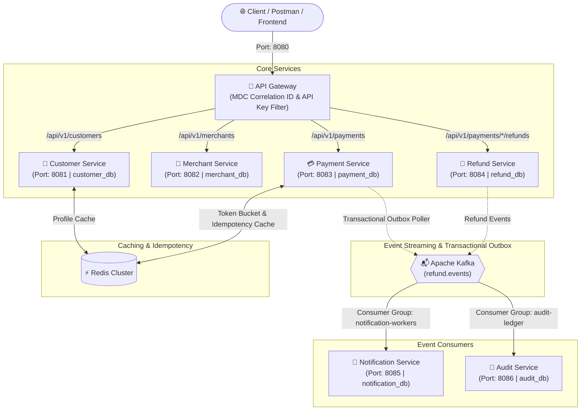
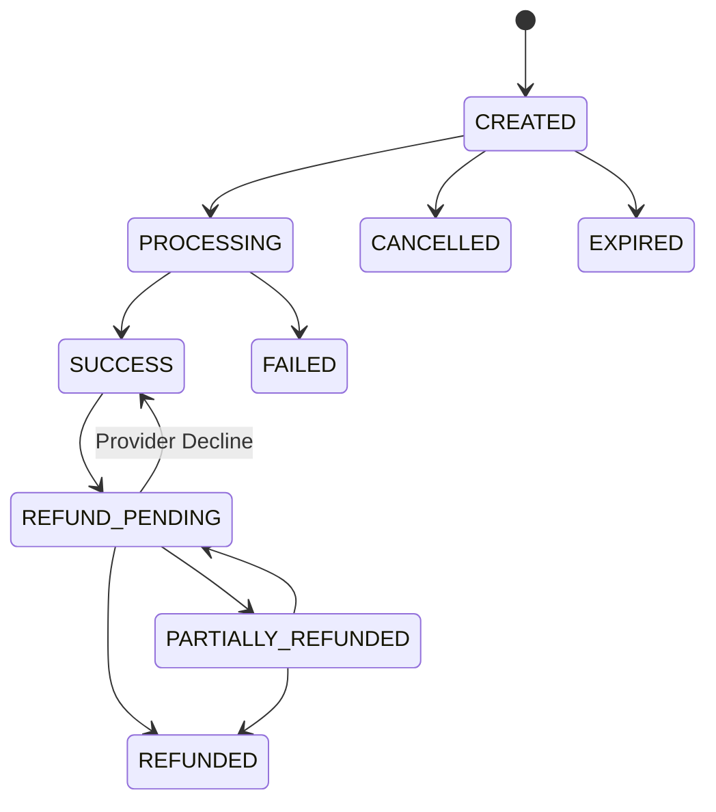

# 💳 Distributed Payment Gateway Platform

[](https://openjdk.org/)
[](https://spring.io/projects/spring-boot)
[](https://spring.io/projects/spring-cloud)
[](https://kafka.apache.org/)
[](https://redis.io/)
[](https://www.mysql.com/)
[](https://www.docker.com/)

A production-grade, event-driven distributed payment processing backend engineered with **Java 21**, **Spring Boot 3.3**, **Spring Cloud Gateway**, **Database-per-Service (MySQL)**, **Apache Kafka**, **Redis**, and **Docker Compose**.

---

## 🏛️ System Architecture



---

## 🧩 Microservices Overview

| Microservice | Port | Database Schema | Primary Responsibilities |
|---|:---:|:---:|---|
| **api-gateway** | `8080` | *None (Stateless)* | Unified ingress routing, Distributed Tracing (`X-Correlation-Id` MDC), API Key authentication filter. |
| **customer-service** | `8081` | `customer_db` | Customer lifecycle onboarding (`ACTIVE`, `SUSPENDED`), profile retrieval, Redis cache. |
| **merchant-service** | `8082` | `merchant_db` | Merchant onboarding, cryptographically secure API key generation (`mcht_live_...`), validation endpoint. |
| **payment-service** | `8083` | `payment_db` | Payment ingestion, OpenFeign validation, Dual-layer Idempotency, State Machine, Transactional Outbox. |
| **refund-service** | `8084` | `refund_db` | Partial & full refund processing, over-refund prevention aggregate queries, optimistic locking (`@Version`). |
| **notification-service**| `8085` | `notification_db` | Idempotent Kafka consumer for payment/refund events, simulated multi-channel dispatch (Email & SMS). |
| **audit-service** | `8086` | `audit_db` | Append-only immutable ledger, domain event sourcing timeline queries by aggregate ID (`paymentReference`). |

---

## 💡 Key Architectural Patterns & Features

### 1. Database-Per-Service Pattern
Each microservice strictly encapsulates its own MySQL database schema. There are **no cross-service joins or shared tables**. Inter-service data requirements are handled synchronously via **OpenFeign** (with resilience timeouts) and asynchronously via **Kafka**.

### 2. Dual-Layer Distributed Idempotency
Guarantees strict **Exactly-Once Execution semantics** for payment processing:
- **Fast-Path Layer**: Redis key lookup (`idempotency:{merchantId}:{key}`, TTL 24h) returns cached responses in `<2ms`.
- **ACID Database Layer**: Unique constraint on `(merchant_id, idempotency_key)` in MySQL prevents duplicate insertions even under high-concurrency race conditions.
- **Payload Integrity**: Sending the same key with a modified amount or currency returns `422 IDEMPOTENCY_CONFLICT`.

### 3. Payment State Machine
Transitions are strictly validated against a deterministic finite state machine:



### 4. Transactional Outbox Pattern
Solves the distributed dual-write problem without requiring slow Two-Phase Commits (2PC):
1. In a single local ACID transaction, the payment record and an `outbox_events` row are committed together.
2. A background `OutboxPublisherService` polls pending events, publishes them to Kafka with partition key ordering, and updates their status to `PUBLISHED`.

### 5. Over-Refund Prevention & Optimistic Locking
- Real-time aggregate calculation `SUM(amount)` ensures total refunded amount can never exceed the original charge.
- JPA `@Version` optimistic locking guards against concurrent refund race conditions.

---

## 🚀 Quick Start with Docker Compose

### Prerequisites
- **Java 21 LTS**
- **Maven 3.9+**
- **Docker & Docker Compose**

### 1. Build and Run
```bash
# 1. Clone repository
git clone https://github.com/<YOUR_USERNAME>/PaymentSystem.git
cd PaymentSystem

# 2. Package all microservices
mvn clean package -DskipTests

# 3. Spin up all 10 containers in background
docker-compose up --build -d

# 4. Check status
docker-compose ps
```

---

## 🧪 End-to-End API Testing Guide

All requests are routed through the **API Gateway** on **`http://localhost:8080`**.

You can execute tests via the included [test-endpoints.http](file:///Users/aditya/Documents/PaymentSystem/test-endpoints.http) file or using the cURL / Postman requests below:

### Step 1: Register Customer
```bash
curl -X POST http://localhost:8080/api/v1/customers \
  -H "Content-Type: application/json" \
  -d '{
    "name": "Sarah Connor",
    "email": "sarah.connor@cyberdyne.com",
    "phone": "+14155552671"
  }'
```

### Step 2: Register Merchant & Obtain API Key
```bash
curl -X POST http://localhost:8080/api/v1/merchants \
  -H "Content-Type: application/json" \
  -d '{
    "name": "Cyberdyne Systems",
    "email": "billing@cyberdyne.com"
  }'
```
*Save the returned `apiKey` (e.g., `mcht_live_...`).*

### Step 3: Authorize & Process Payment ($100.00)
```bash
curl -X POST http://localhost:8080/api/v1/payments \
  -H "Content-Type: application/json" \
  -H "X-API-Key: <YOUR_MERCHANT_API_KEY>" \
  -H "Idempotency-Key: pay_order_001_unique_key" \
  -d '{
    "customerId": 1,
    "merchantId": 1,
    "amount": 100.00,
    "currency": "USD"
  }'
```
*Save the returned `paymentReference` (e.g., `pay_...`).*

### Step 4: Verify Idempotency Replay
Re-send the **exact same request** from Step 3:
- Returns the previous transaction instantly without creating a duplicate record or charge.

### Step 5: Issue Partial Refund #1 ($30.00)
```bash
curl -X POST http://localhost:8080/api/v1/payments/<PAYMENT_REF>/refunds \
  -H "Content-Type: application/json" \
  -H "X-API-Key: <YOUR_MERCHANT_API_KEY>" \
  -d '{
    "amount": 30.00,
    "reason": "Customer returned partial item"
  }'
```

### Step 6: Check Refund Summary & Available Balance
```bash
curl -X GET http://localhost:8080/api/v1/payments/<PAYMENT_REF>/refunds/summary \
  -H "X-API-Key: <YOUR_MERCHANT_API_KEY>"
```
*Response:*
```json
{
  "paymentReference": "pay_...",
  "originalAmount": 100.00,
  "totalRefunded": 30.00,
  "remainingRefundable": 70.00
}
```

### Step 7: Verify Event Stream Consumers
- **View Dispatched Notifications (Email & SMS)**:
  ```bash
  curl http://localhost:8080/api/v1/notifications
  ```
- **View Immutable Audit Trail**:
  ```bash
  curl http://localhost:8080/api/v1/audit-events/aggregate/<PAYMENT_REF>
  ```

---

## 🎯 Mock Payment Provider Failure Simulations

The built-in payment acquiring mock provider simulates real-world banking edge cases based on request decimal cents:

| Amount Ending | Simulated Outcome | HTTP Status / Error Code |
|:---:|---|---|
| `xx.00` | Approved / Captured | `200 SUCCESS` |
| `xx.91` | Insufficient Funds | `400 INSUFFICIENT_FUNDS` |
| `xx.92` | Card Network Timeout | `504 GATEWAY_TIMEOUT` |
| `xx.93` | Acquiring Bank 500 Error | `502 PROVIDER_ERROR` |
| `xx.94` | Hard Decline / Lost Card | `400 FAILED` |

---

## 📖 Swagger / OpenAPI Documentation

When running locally or in Docker, interact with OpenAPI documentation at:
- **Customer Service**: `http://localhost:8081/swagger-ui.html`
- **Merchant Service**: `http://localhost:8082/swagger-ui.html`
- **Payment Service**: `http://localhost:8083/swagger-ui.html`
- **Refund Service**: `http://localhost:8084/swagger-ui.html`
- **Notification Service**: `http://localhost:8085/swagger-ui.html`
- **Audit Service**: `http://localhost:8086/swagger-ui.html`

---

## 📂 Project Repository Structure

```
PaymentSystem/
├── .gitignore                   # Git exclusion rules
├── .dockerignore                # Docker build optimization
├── .env.example                 # Environment variables template
├── docker-compose.yml           # Multi-service infrastructure orchestration
├── pom.xml                      # Parent Maven POM
├── test-endpoints.http          # REST Client test suite
├── README.md                    # Project documentation
├── docker/
│   └── mysql/
│       └── init.sql             # Database schemas initialization
├── api-gateway/                 # Spring Cloud Gateway (Port: 8080)
├── customer-service/            # Customer Onboarding & Profiles (Port: 8081)
├── merchant-service/            # Merchant Onboarding & API Keys (Port: 8082)
├── payment-service/             # Core Ingestion, State Machine, Outbox (Port: 8083)
├── refund-service/              # Balance Guards & Optimistic Locking (Port: 8084)
├── notification-service/        # Kafka Consumer for SMS/Email (Port: 8085)
└── audit-service/               # Kafka Consumer for Audit Log Ledger (Port: 8086)
```

---

## 📄 License
This project is licensed under the MIT License.
